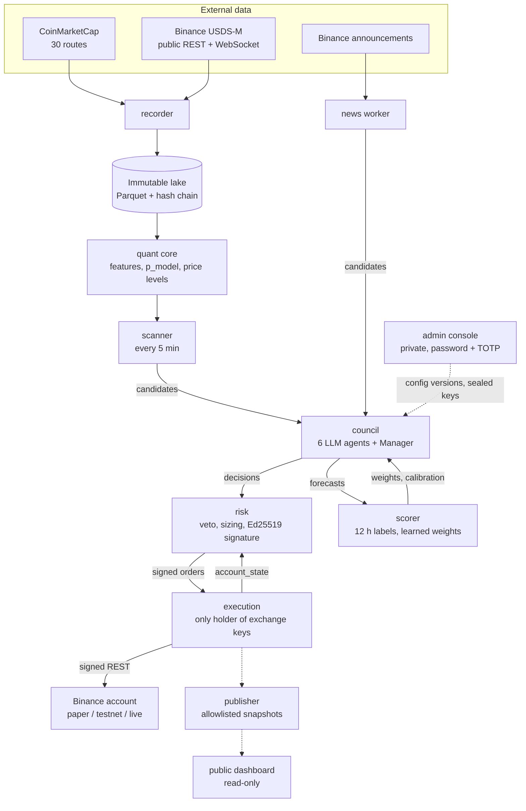
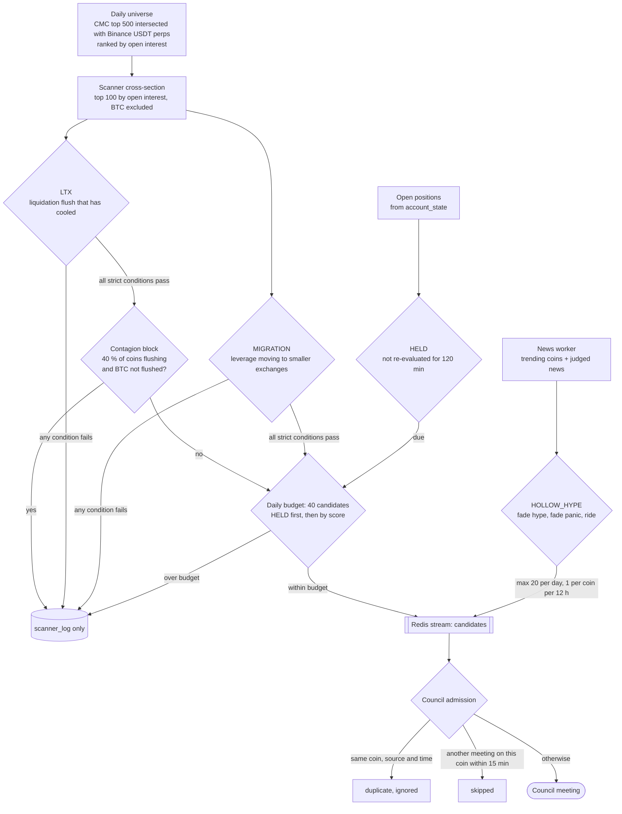
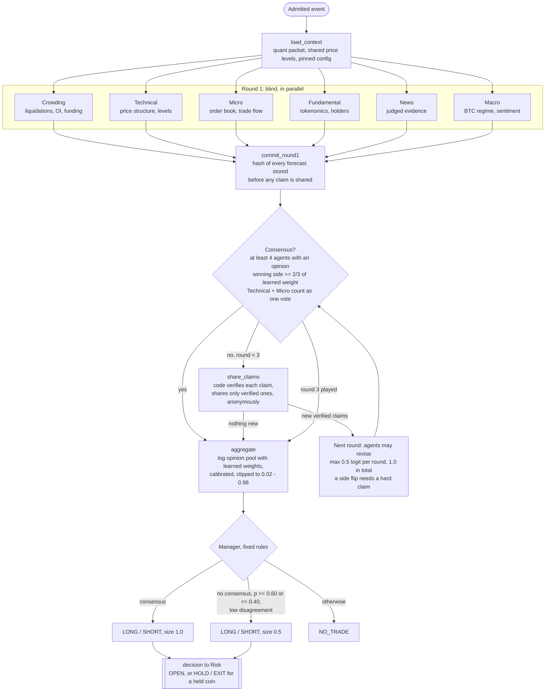
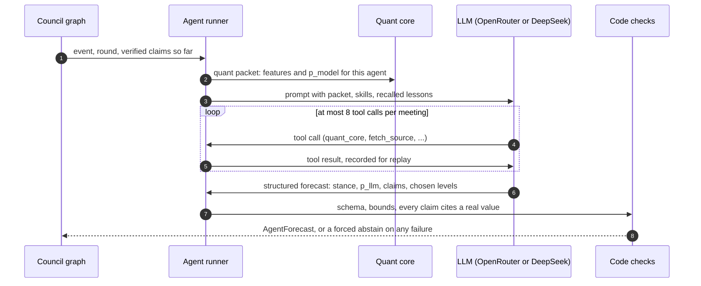

<picture>
  <source media="(prefers-color-scheme: dark)" srcset="brand/logo/moirai-lockup-horizontal.svg">
  
</picture>

# Moirai

AI council for crypto perpetual futures trading on Binance USDS-M. A deterministic quantitative core picks the coins worth a meeting; six LLM agents forecast each one, debate for at most three rounds with code-verified anonymous claims, and a fixed-rule Manager decides. An independent Risk service sizes and signs every order, and an Execution service is the only component holding exchange keys. Agent weights learn from how their forecasts turn out 12 hours later.

Repository `Moirai`, Python package `hdt`. Brand assets and guide: `brand/`.

> **Financial risk warning.** This software trades leveraged derivatives. Leveraged trading can lose more than the capital allocated to it, and past or simulated performance does not predict future results. The system runs paper trading first and may only trade real money after the statistical shadow gate G4 passes, at 1/4 size, on a limited-capital sub-account with a trade-only API key (no withdrawals, IP whitelist). Nothing in this repository is investment advice. Use it at your own risk.

## Contents
- [System at a glance](#system-at-a-glance)
- [How a coin reaches the council](#how-a-coin-reaches-the-council)
- [How the council works](#how-the-council-works)
- [External APIs](#external-apis)
- [Development](#development)
- [Documentation](#documentation)

## System at a glance
Every service talks to the others only through Redis streams and its own Postgres role. Market data is recorded once, verbatim, into an append-only lake, and every decision is computed from point-in-time reads of that lake.



| Service | Role |
|:--|:--|
| recorder | Polls CoinMarketCap and Binance, writes every response verbatim with `fetched_at` and sha256, builds the daily coin universe |
| quant core | Computes every number the agents see: per-agent features, a logistic `p_model` per agent, one shared set of entry / stop / target levels per coin |
| scanner | Decides which coins convene the council (next section) |
| council | Runs the meeting as a LangGraph graph with a Postgres checkpoint, so a restart resumes where it stopped |
| risk | Fail-closed news veto, deterministic sizing, hard ceilings (leverage <= 3x, risk <= 0.5 % per trade, daily loss -2 % kills the account), BTC hedge book, Ed25519-signed order intents |
| execution | Verifies signatures, applies its own hard limits, places orders, keeps a STOP on every position, reconciles with Binance, kill switch |
| scorer | Labels every forecast after 12 h and updates agent weights and calibration |

## How a coin reaches the council
Once a day the recorder builds the universe: CoinMarketCap top 500 intersected with Binance USDT perpetuals, ranked by Binance open interest. Every 5 minutes the scanner evaluates the top 100 of that list. BTC is never a candidate: it is the market reference and the hedge book.



| Rule | Fires when (strict thresholds, `config/scanner.yaml`) | Side |
|:--|:--|:--|
| **LTX** Liquidation Term-Structure Exhaustion | one side took >= 60 % of the 4 h liquidations; liquidations over the last 3 h ran >= 4x their normal hourly rate; the last hour cooled to <= 0.35x of that burst; the coin's liquidations / open interest is >= 1.5 sigma above the other coins; open interest fell >= 6 % in 4 h; hourly funding moved back by >= 50 % (fell after a long flush, rose after a short flush) | fades the flush: LONG after longs were liquidated, SHORT after shorts were |
| **MIGRATION** Leverage Migration | peripheral exchanges hold >= 20 % of the open interest; that share is >= 2 sigma above its 14-day history; peripheral open interest grew >= 5 points faster than core in 24 h; the basis gap between peripheral and core is >= 0.1 % | SHORT when the peripheral basis is richer, else LONG |
| **HOLLOW_HYPE** | the News agent's rules find hype or panic without substance, or a hard first-report catalyst the crowd is positioned against | set by the news mode |
| **HELD** | the account holds the coin and it was not re-evaluated in the last 120 min | HOLD or EXIT only |

Every evaluation, emitted or not, is written to `scanner_log`, so the thresholds can be audited and calibrated on the recorded lake.

## How the council works
Each admitted event runs one meeting. Agents never see each other's round-1 answers, every claim they exchange is checked by code first, and the LLM can only nudge the quant model's probability by a bounded amount.



How one agent produces its forecast:



The final probability is `z_used = z_model + a * clip(z_llm - z_model, -0.5, 0.5)` in logit space: the quant model anchors, and the learned trust `a` of each agent decides how far its LLM may move it. No LLM ever writes a price, a size or an order.

## External APIs
| Provider | Used for | Endpoints | Auth |
|:--|:--|:--|:--|
| **CoinMarketCap** (Startup plan) | Signal layer: derivatives liquidations and open interest per exchange, quotes and OHLCV, listings (universe), trending and gainers (attention), Fear & Greed, altcoin season, CMC20 / CMC100, global metrics, categories, DEX security / pools / liquidity / holders, exchange assets, key usage | 30 routes (29 REST + 1 WebSocket) under `pro-api.coinmarketcap.com` (`/v5/derivatives/...`, `/v5/exchange/...`, `/v3/cryptocurrency/...`, `/v1/dex/...`, `/v1/key/info`, ...); full catalog in `config/cmc_routes.yaml` | `X-CMC_PRO_API_KEY`, or the keyless `/public-api` pool for the routes that allow it; a credit meter and governor keep usage inside the plan |
| **Binance USDS-M Futures**, public | Universe, marks, klines, depth, trades, funding, open interest, forced-liquidation feed | REST `fapi.binance.com`: `exchangeInfo`, `fundingInfo`, `klines`, `markPriceKlines`, `depth`, `openInterest`, `openInterestHist`, `premiumIndex`, `time`; WebSocket `fstream.binance.com`: `depth20`, `kline_5m/15m`, `aggTrade`, `markPrice@1s`, `!forceOrder@arr` | none |
| **Binance USDS-M Futures**, signed | Trading (execution service only): orders, conditional STOP / TAKE_PROFIT algo orders, leverage and isolated margin, positions, balances, user data stream, key permission check | `/fapi/v1/order`, `/fapi/v1/algoOrder`, `/fapi/v1/leverage`, `/fapi/v1/marginType`, `/fapi/v3/positionRisk`, `/fapi/v3/account`, `/fapi/v1/listenKey`, `/fapi/v1/userTrades`, `/sapi/v1/account/apiRestrictions`; live host and `demo-fapi.binance.com` for testnet | HMAC API key with trading only (no withdrawals, IP whitelist), sealed in the vault |
| **Binance announcements** | Listing and delisting evidence for the News agent and the news veto | `www.binance.com/bapi/composite/v1/public/cms/article/list/query` | none |
| **OpenRouter** | Default LLM gateway for the six agents and the news extractor / judges; the model per role is chosen on the admin console | `openrouter.ai/api/v1`: `/chat/completions` (strict JSON schema, pinned provider, no fallbacks, no data collection), `/models`, `/key` | API key, sealed in the vault |
| **DeepSeek** (optional) | Alternative LLM gateway for roles configured with `gateway: deepseek` | `api.deepseek.com`: `/chat/completions`, `/user/balance` | API key, sealed in the vault |
| **Telegram Bot API** | Owner alerts and commands | `getMe`, `getWebhookInfo`, `sendMessage`, `getUpdates` | bot token, sealed in the vault |
| **S3-compatible storage** (optional) | Encrypted (age) Postgres and lake backups | bucket from `HDT_BACKUP_TARGET` | Docker secret |
| **Dead-man check** (optional) | External ping from Alertmanager's Watchdog, so a dead monitoring stack still pages | healthchecks.io-style ping URL | Docker secret |

Self-hosted, never public: Postgres 16, Redis 7, Langfuse (LLM traces), Prometheus, Grafana, Alertmanager. All outbound traffic leaves through allowlist proxies (`deploy/squid`), one destination list per service. Details, rate limits and verification log: [`docs/api-endpoints-design.md`](docs/api-endpoints-design.md).

## Development
```bash
uv python install 3.12
uv sync --frozen
cp .env.example .env                              # local bootstrap values only, git-ignored
uv run python scripts/check_env.py
docker compose -f docker-compose.dev.yml up -d
uv run alembic upgrade head
uv run pytest
uv run ruff check . && uv run mypy
uv run python scripts/check_language.py
```
Application API keys (CMC, OpenRouter, DeepSeek, Binance, Telegram, news feed) are never placed in `.env`; they are entered on the admin console and sealed per scope in the browser. See [`docs/deployment-guide.md`](docs/deployment-guide.md).

## Language policy
The whole repository is English: code, identifiers, comments, logs, UI copy, LLM prompts, commit messages and docs. `scripts/check_language.py` enforces it in pre-commit and CI.

## Documentation
| Doc | Content |
|:--|:--|
| [project-overview-pdr](docs/project-overview-pdr.md) | goals, requirements, gates, non-goals |
| [system-architecture](docs/system-architecture.md) | services, networks, contracts, streams, producer/consumer matrix |
| [api-endpoints-design](docs/api-endpoints-design.md) | CMC, Binance, OpenRouter, DeepSeek, Telegram, config-api |
| [code-standards](docs/code-standards.md) | toolchain, determinism, security, testing rules |
| [codebase-summary](docs/codebase-summary.md) | repository tree and package ownership |
| [design-guidelines](docs/design-guidelines.md) | console and dashboard design system |
| [deployment-guide](docs/deployment-guide.md) | dev setup, secrets model, VPS target, run modes |
